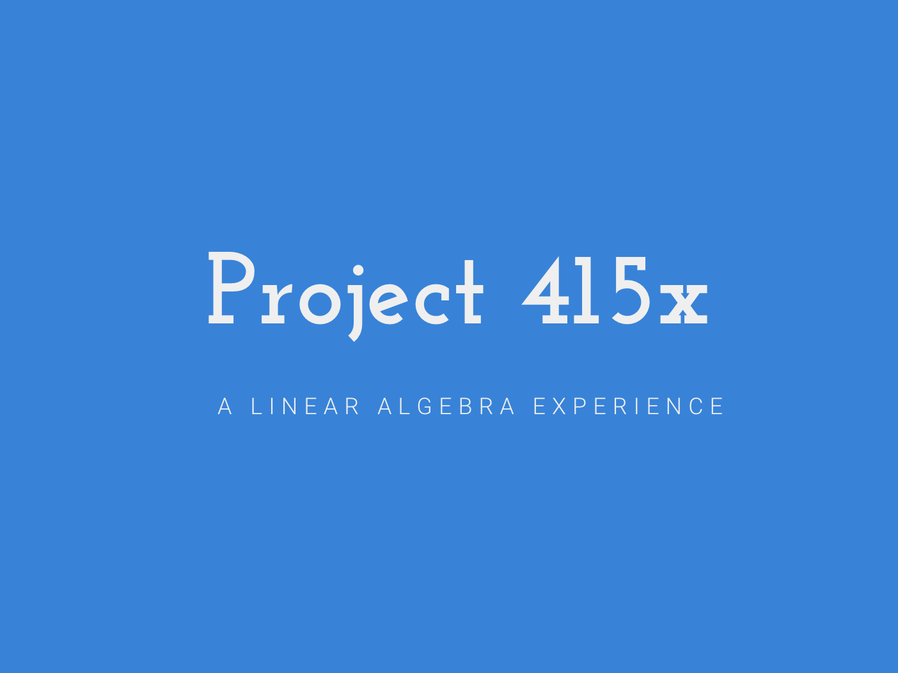

# [Project 415x](http://p415x.xyz/)
[](http://p415x.xyz/)

Project 415x is a learning tool for students to have a direct visual and kinesthetic experience of core concepts in Linear Algebra

## Table of Contents
- [Setup](#setup)
- [About](#about)
- [Team](#team)
- [Issues](#issues)
- [Contributing](#contributing)
- [Versioning](#versioning)
- [License](#license)

## Setup
```bash

$ cd project415x.github.io/p415x/static/game

// Download dependencies
$ npm install
$ bower install

$ cd -

// Install django
$ sudo apt-get install python-pip
$ pip install django

// setup run script

$ chmod +x run.sh

// Start build website and django server
$ ./run.sh
```

## About
Started in Fall 2015 at the University of Illinois at Urbana-Champaign, Project 415x is a MATH 492 Undergraduate Research Project under the supervision of J.L. Doob Research Assistant Professors Cary Malkiewich and Jenya Sapir. The project is aimed at MATH 415 Linear Algebra students to have a direct visual and kinesthetic experience of core concepts in the subject matter. The project includes but not limited to visualization tools and documentation to make the learning experience much more easier for students.

## Team
### Faculty
- [Cary Malkiewich](http://math.uiuc.edu/~cmalkiew/)
- [Jenya Sapir](http://www.math.illinois.edu/~jsapir2/)

### Students
- [Cameron Dart](https://github.com/skamdart)
- [Aneesh Durg](https://github.com/aneeshdurg)
- [Rohan Subramaniam](https://github.com/rohansub)
- [Joseph Milla](https://josephmilla.com/)
- [Z](https://github.com/zwang180)

## Issues
Issues can be anything from suggestions, improvements, bugs, and other thingamajigs.

To file an issue, please [use](https://github.com/project415x/project415x.github.io/issues/new) this. It helps in tracking everything.

## Contributing
Help in developing and maintaining this project would be much appreciated. Please contact either [Prof. Cary Malkiewich](http://math.uiuc.edu/~cmalkiew/) or [Prof. Jenya Sapir](http://www.math.illinois.edu/~jsapir2/) for more information.

## Versioning
For transparency into our release cycle and in striving to maintain backward compatibility, Project415x is maintained under the [Semantic Versioning Guidelines](http://semver.org/). Sometimes we screw up, but we'll adhere to those rules whenever possible.

## Build
Read through the `run.sh` script for info on how to build and start the server.

## License
Code released under the [MIT License](LICENSE).
